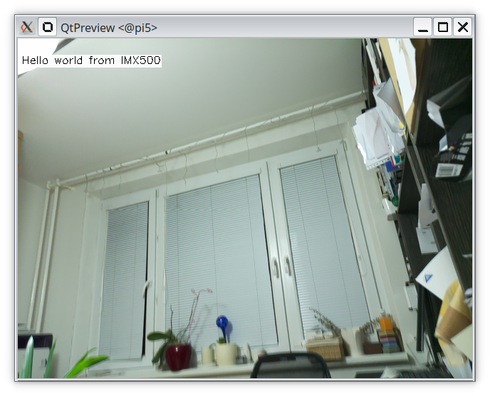

# hello-world

A simple hello-world example. If you are on a fresh new installation of Raspbian OS, you may want
to start by installing all necessary packages with:
```
  export PATH=$PATH:~/.local/bin
  make install-dep
```
to compile hello-world package loadable to Raspberry Pi AI camera, type:
```
  make compile
```
to execute hello-world on AI camera type:
```
  make run
```

Expected result is like: 
