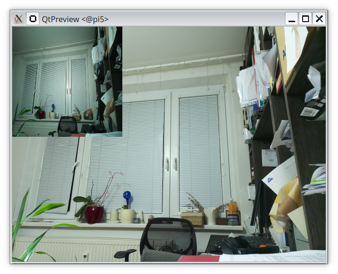

# show tensor

The default size of the tensor entering IMX500 "neural network" is 224x224 pixels. This example
copies the input tensor into left upper corner of the displayed camera stream. It is no surprise that
it is the same image as coming from camera.

If you are on a fresh new installation of Raspbian OS, you may want to start by installing all necessary packages with:
```
  export PATH=$PATH:~/.local/bin
  make install-dep
```
to compile this example into a package loadable to Raspberry Pi AI camera, type:
```
  make compile
```
to execute the example on AI camera type:
```
  make run
```

Expected result is like: 
