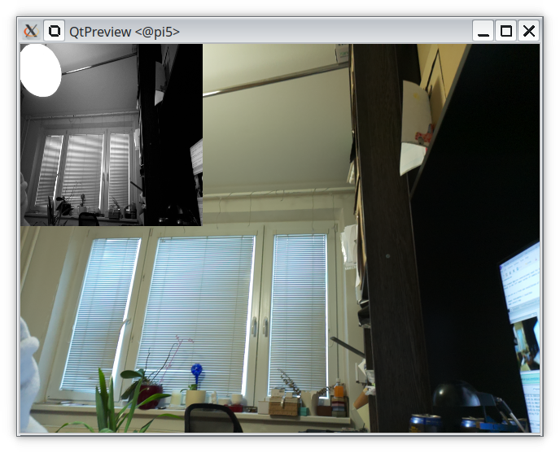

# grayscale


This example translates incoming color image to grayscale and shows it in the left upper corner of camera stream.


If you are on a fresh new installation of Raspbian OS, you may want to start by installing all necessary packages with:
```
  export PATH=$PATH:~/.local/bin
  make install-dep
```
to compile this example to a package loadable to Raspberry Pi AI camera, type:
```
  make compile
```
to execute the example on AI camera type:
```
  make run
```

Expected result is 
